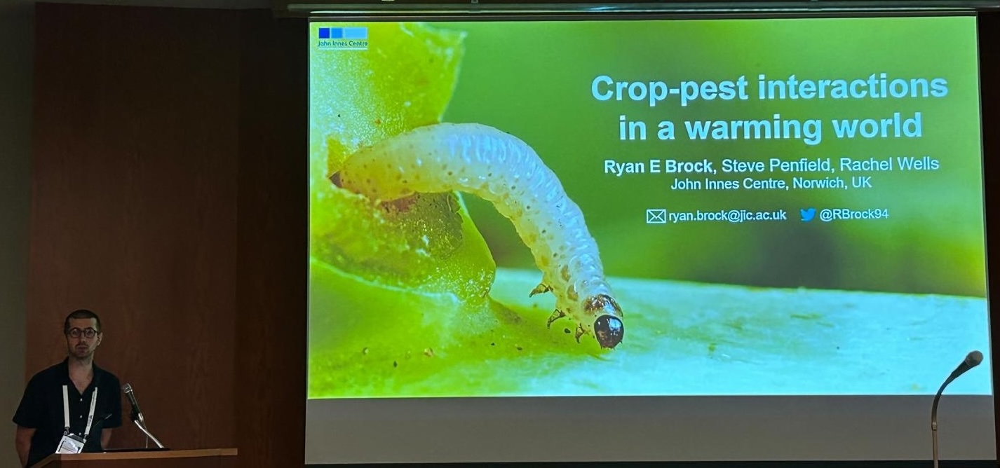



### International Congress of Entomology, Kyoto, Japan, August 2024

I attended the International Congress of Entomology (25-30th August, Kyoto, Japan) and presented ongoing work on how warmer winters impact plant-insect interactions between Oilseed Rape (*Brassica napus*) and the Cabbage Stem Flea Beetle (*Psylliodes chrysocephala*).

Post-conference, I spent an extra two weeks in Japan, during which I visited Osaka, Hiroshima and Tokyo, cycled the Shimanami Kaido, and went hiking in the Japanese alps.
