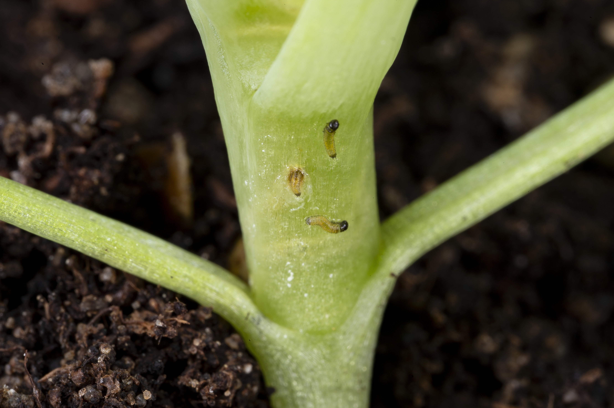



## Funded undergraduate summer studentship – Investigating multi-insect resistance in Oilseed Rape

We are currently advertising a **funded** 10-week undergraduate summer studentship at the [John Innes Centre](https://www.jic.ac.uk/), through the Royal Society of Biology’s [Plant Health Undergraduate Studentship](https://www.rsb.org.uk/get-involved/grants/plant-health-ug-studentships) programme. 
 
The student will investigate crop-pest interactions across a diverse panel of Oilseed Rape (*Brassica napus*) genotypes, specifically focussing on resistance/susceptibility to both Cabbage Stem Flea Beetle (*Psylliodes chysocephala*) and the Green Peach Aphid (*Myzus persicae*).

The student will gain experience in:
* Plant and insect husbandry
* Experimental design, crop-pest experimentation, and statistical analyses (using R)
* Semi-automated image phenotyping
* Scientific record keeping and data management

The studentship will take place during the summer of 2025 (ideal start date: 16th June 2025) and is open to students who are registered at a UK university and in the middle years (i.e. 2/3, 2/4 or 3/4) of their degree. Final year undergraduates intending to continue to study for a Master’s or PhD may also be considered. Successful students will receive a stipend of £400 per week.
 
Interested students can apply [here](https://my.rsb.org.uk/services.php?section=grants&grantid=117) or contact Dr Ryan Brock (Ryan.Brock@jic.ac.uk) or Dr Rachel Wells (Rachel.Wells@jic.ac.uk) for more information about the project.
 
**Application deadline: 23:59 on Friday 25th April 2025.**